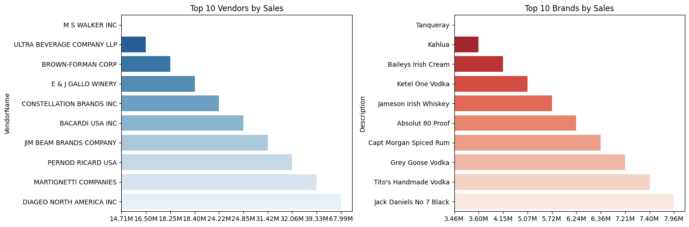
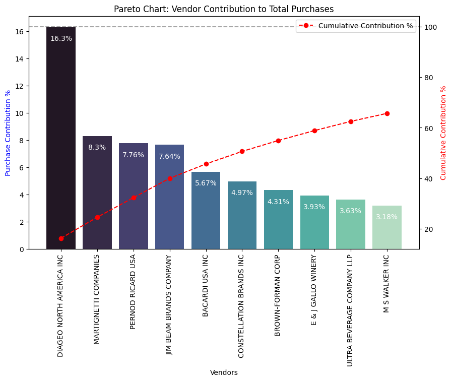
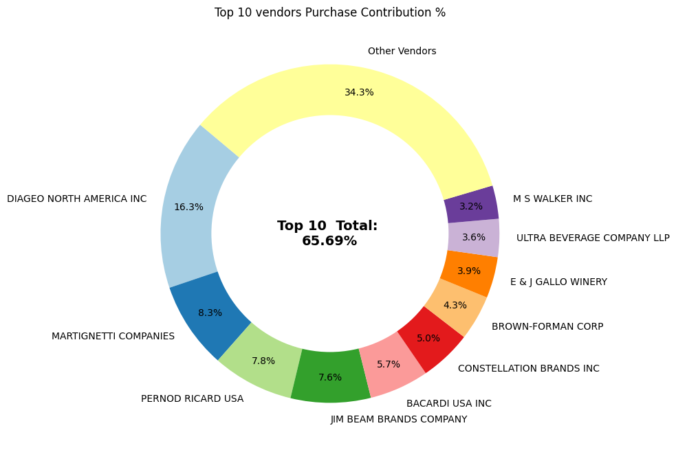
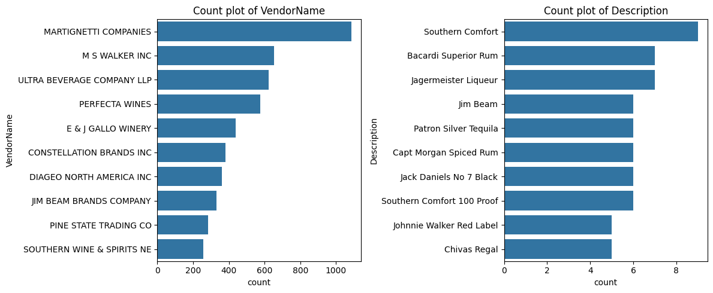
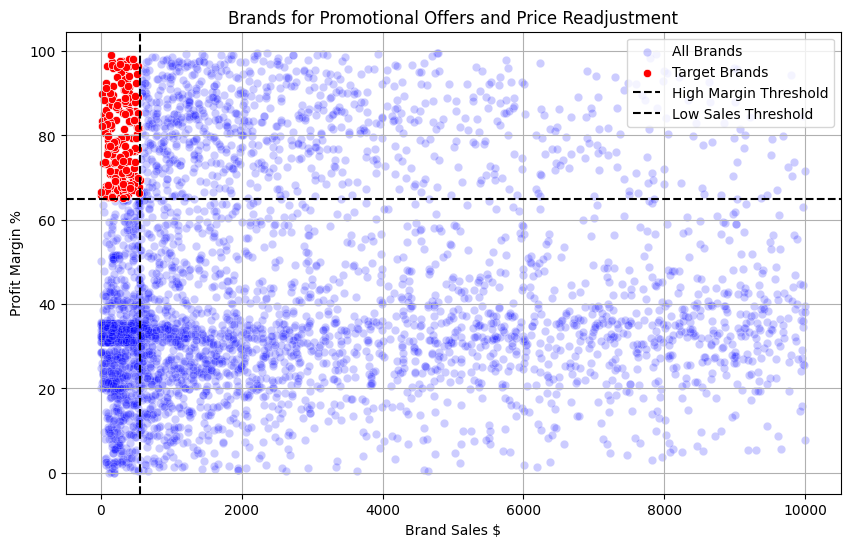
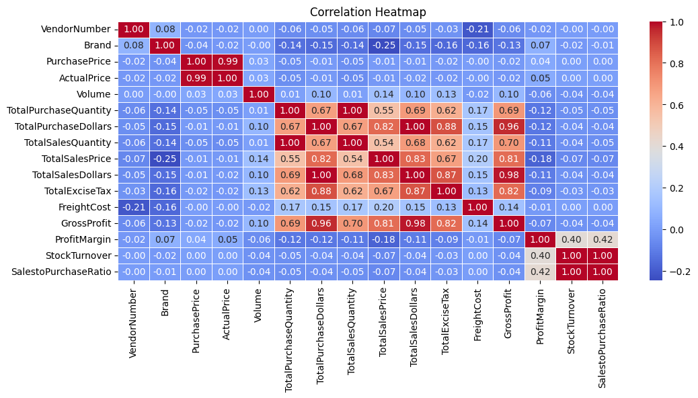
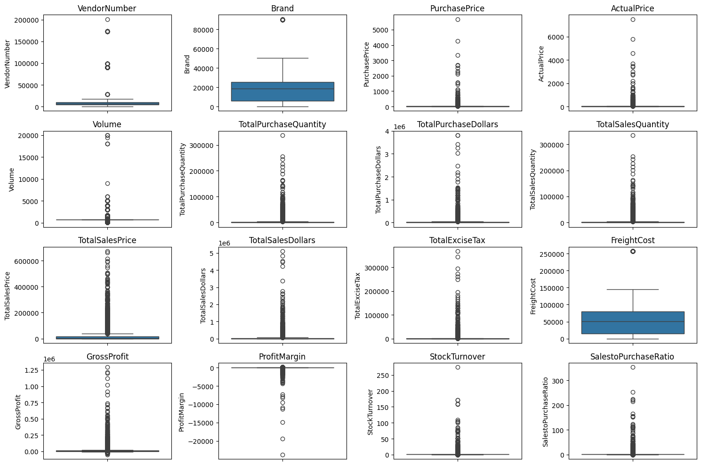
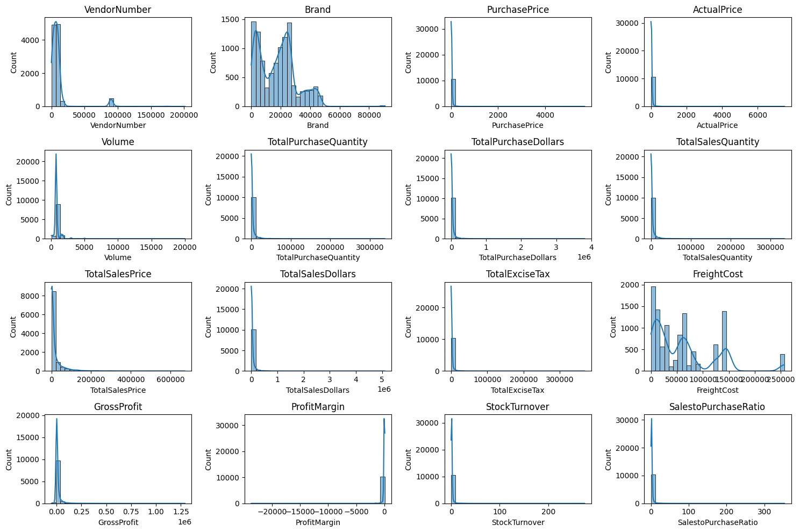
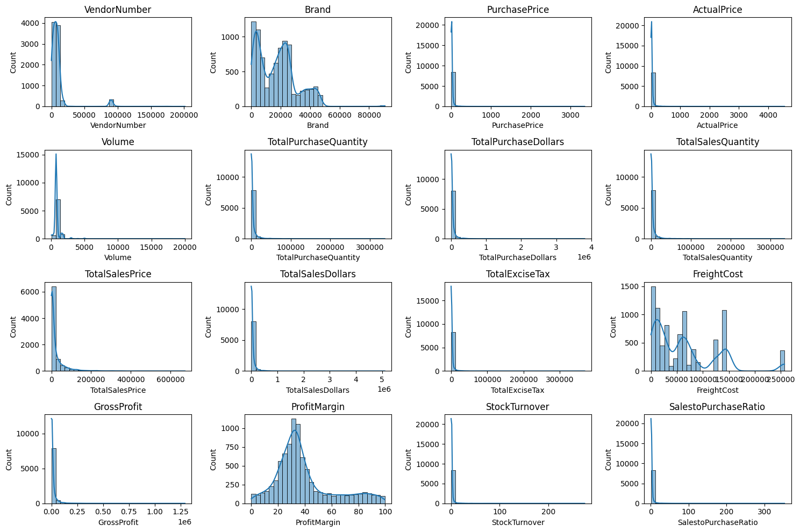
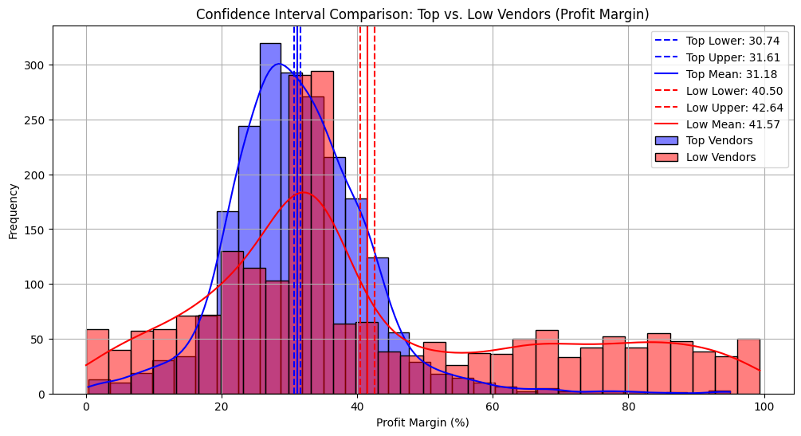

# Vendor Performance Analysis

**One‑liner:** A clear, end‑to‑end analysis that consolidates purchase, sales, freight and price data to evaluate vendor performance, find outliers, and produce actionable insights and a Power BI dashboard.

---

## 🚀 Project Goal (in plain words)
This project builds a single, analysis‑ready table (`VendorSalesSummary`) from multiple raw tables (purchases, purchase prices, vendor invoices and sales), performs exploratory data analysis (EDA), computes vendor metrics (sales, profit margin, unsold inventory, stock turnover, freight cost), visualizes results, and packages an interactive Power BI dashboard for stakeholders.

This README tells you **what the project contains**, **how to run it**, **what each file/folder is for**, and **how to interpret the results** — so anyone reading this will know exactly what the project does and how to reproduce it.

---

## 📁 Project structure (what's in the repo)
```
/Notebooks/                   # Step-by-step analysis & EDA (Jupyter)
  1_Data_Import.ipynb         # Data ingestion notes and helpers
  2_Exploratory_Data_Analysis.ipynb  # EDA, aggregation logic
  3_Vendor_Performance_Analysis.ipynb # Final vendor-level analysis & visuals

/Python Scripts/              # Reproducible scripts to ingest and build the summary
  1_Data_ingestion.py         # Ingest CSV files into sqlite DB (data/ -> inventory.db)
  2_get_vendor_summary.py     # Create/clean the VendorSalesSummary table

/Visuals/                     # Static images produced by notebooks
  barplot.png
  boxplot.png
  columnchart.png
  countplot.png
  donutchart.png
  heatmap.png
  histogram.png
  histplot.png
  histplot_high_low_vendors.png
  scatterplot.png

/PowerBI Dashboard/
  VendorPerformanceSummary.pbix  # Power BI file (open with Power BI Desktop)

/logs/                        # Script execution logs
/data/ (expected, **not** included) # Place raw CSV files here before running ingestion
```

---

## 🧾 Expected raw tables / files
Place your raw CSVs in a folder named `data/` at the project root before running ingestion. The notebooks/scripts expect (at minimum) the following logical tables (filenames typically = `{table}.csv`):
- `purchases.csv` — vendor purchase transactions (VendorNumber, Brand, PurchasePrice, Quantity, Dollars, ...)
- `purchase_prices.csv` — product price reference (Brand, Price, ...)
- `vendor_invoice.csv` — freight & invoice level details (VendorNumber, Freight, ...)
- `sales.csv` — sales transactions (VendorNo / VendorNumber, SalesQuantity, SalesPrice, ExciseTax, ...)

> If your CSVs use different filenames adjust `1_Data_ingestion.py` or rename files accordingly.

---

## 🧩 High-level data/schema (columns you will see in the final summary)
The analysis produces a `VendorSalesSummary` (also saved as `data/VendorPerformanceSummary.csv`) that contains aggregated vendor/brand level fields such as:
- `VendorNumber` / `VendorName` — vendor identifier and name
- `Brand` / `Description` — product identity
- `TotalPurchaseQuantity`, `TotalPurchaseDollars` — sums of purchased units and purchase cost
- `TotalSalesQuantity`, `TotalSalesDollars`, `TotalSalesPrice` — sums of sold units and revenue
- `PurchasePrice`, `ActualPrice` — vendor purchase price and product price reference
- `FreightCost` / `TotalExciseTax` — aggregated logistics/tax costs
- `GrossProfit`, `ProfitMargin` — profitability metrics (computed in notebook)
- `UnsoldInventoryValue` — computed as `(TotalPurchaseQuantity - TotalSalesQuantity) * PurchasePrice`
- `StockTurnover` — inventory turnover indicator (present in notebook analysis)

> Exact formulas and column creation steps are implemented in `Notebooks/` and `Python Scripts/2_get_vendor_summary.py` — open them to see each calculation line‑by‑line.

---

## 📌 How to reproduce (Quick Start)
Open a terminal at the repository root and run the following steps:

1. Create a Python virtual environment (recommended):
```bash
python3 -m venv venv
source venv/bin/activate   # on Windows use: venv\Scripts\activate
```

2. Install required packages (example list):
```bash
pip install pandas sqlalchemy jupyter matplotlib seaborn scipy
```

3. Add raw CSV files into the `data/` folder. Filenames should match table names (e.g. `purchases.csv`, `purchase_prices.csv`, `vendor_invoice.csv`, `sales.csv`).

4. Ingest raw CSVs into an SQLite database (`inventory.db`):
```bash
python "Python Scripts/1_Data_ingestion.py"
```
This script will create `inventory.db` and log progress to `logs/data_ingestion.log`.

5. Build the combined vendor summary table:
```bash
python "Python Scripts/2_get_vendor_summary.py"
```
This generates the `VendorSalesSummary` table inside `inventory.db` and writes `data/VendorPerformanceSummary.csv`.

6. Open the Jupyter notebooks in order for exploration and to reproduce the visuals:
```bash
jupyter notebook Notebooks/1_Data_Import.ipynb
jupyter notebook Notebooks/2_Exploratory_Data_Analysis.ipynb
jupyter notebook Notebooks/3_Vendor_Performance_Analysis.ipynb
```

7. Open the Power BI file `PowerBI Dashboard/VendorPerformanceSummary.pbix` in Power BI Desktop for an interactive dashboard.

---



*The barplot reveals that a few vendors dominate total sales and profit, indicating revenue concentration among top performers.*



*The column chart shows clear differences in sales across vendors, underlining uneven performance distribution.*



*The donut chart illustrates that top vendors account for the majority of sales share, while many smaller vendors contribute marginally.*



*The countplot demonstrates how frequently products or vendors appear, showing skewed representation across categories.*

## 🔍 Key metrics & definitions (simple and clear)
- **Total Sales ($)** — sum of sales revenue for a brand/vendor.
- **Total Purchase ($)** — sum of purchase spend for a brand/vendor.
- **Gross Profit ($)** — (Total Sales $) − (Total Purchase $) − related costs (freight, excise where applied).
- **Profit Margin (%)** — `Gross Profit / Total Sales $ * 100` (noted in notebooks; open code for the exact implementation).
- **Unsold Inventory Value ($)** — `(TotalPurchaseQuantity - TotalSalesQuantity) * PurchasePrice` (explicitly computed in the notebooks).
- **Stock Turnover** — how quickly stock is sold over time (higher is faster). Implementation and exact denominator used are shown in the notebook.

---

## 🎯 Key findings## 🎯 Key findings (from the notebooks)


*The scatterplot demonstrates a near-linear relationship between purchases and sales, confirming that inventory generally sells proportionally to procurement.*



*The heatmap confirms strong positive correlation between total purchased and total sold quantities, validating demand alignment.*



*The boxplot highlights significant outliers in freight costs, suggesting irregular charges or special shipping cases.*



*The histogram shows that profit margins and sales distributions are skewed, with many vendors clustered at low values and few high outliers.*



*The histplot reinforces the skewed distribution of vendor sales, emphasizing that most vendors generate low revenue compared to a few high performers.*



*The histplot comparison shows distinct separation: top vendors maintain consistently higher sales while low performers cluster near zero.*

- **Large outliers in freight costs** — freight values vary greatly (min near 0, max very large), suggesting either data issues or bulk shipments / special logistics cases.
- **Wide price variation** — Purchase and Actual Prices show high standard deviations; some products are premium priced.
- **Stock turnover is uneven** — values range from very low (0) to high (>200), indicating inconsistent inventory management across items/vendors.
- **Strong correlation between total purchased quantity and total sold quantity** — the notebooks report a very high correlation (close to 1), confirming purchases generally match sales volumes per brand/vendor.

> See `Notebooks/2_Exploratory_Data_Analysis.ipynb` and `Notebooks/3_Vendor_Performance_Analysis.ipynb` for plots and statistical analysis that support these findings.

---

## ✅ Recommended next steps / enhancements
- Add automated data validation for freight & price outliers.
- Build a scheduled pipeline to refresh `VendorSalesSummary` and push to a BI dataset.
- Add vendor segmentation and anomaly detection (e.g., flag sudden jumps in freight or negative profit margins).
- Time‑series forecasting of demand per brand to optimize purchase quantities.

---

## 🙋‍♀️ Notes & where to look for details
- **Exact calculations** and SQL used to assemble `VendorSalesSummary` are in `Python Scripts/2_get_vendor_summary.py` and in the notebooks — open them to see the SQL and pandas steps line by line.
- **If a raw CSV has a different column name**, either rename the CSV column to match the script expectations or update the ingestion / SQL code accordingly.

---

## 📝 Author
Project owner: **Imran Fakji** (update this line with your actual name/email if you want public credit)

---
